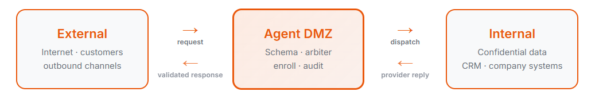

# Agent DMZ

If you run AI agents that talk to the **outside world** (email, chat, the web) and other agents that touch **internal systems** (CRM, files, credentials), putting both jobs in one agent is how prompt injection becomes a data leak or a rogue outbound action. Agent DMZ (`admz`) is the choke point between those two sides.

Use it when you want external and internal agents to **collaborate without talking directly**: clients discover named **actions**, request **enrollment**, and **invoke**; providers publish versioned JSON Schema contracts; an LLM **arbiter** plus schema checks every request and response; humans approve what is allowed *before* traffic runs. You get a contract-first API agents can call without an SDK, least-privilege access you can revoke, and one audit trail of what crossed the boundary.



What it is not: a sandbox for untrusted provider code, a human in the live request path, or a way to merge internet reach and confidential systems into a single agent. Longer positioning is in [Why We Built This](docs/why-we-built-this.md). Normative behavior is the [PRD index](docs/index-v2.md). Licensed [MIT](LICENSE). [Contributing](CONTRIBUTING.md). [Security reports](SECURITY.md).

## Quickstart (Docker Compose)

From the **repo root**. You need Docker. Invokes run an LLM arbiter through **LiteLLM** (default: [OpenRouter](https://openrouter.ai/); OpenAI, Anthropic, and other LiteLLM backends work too).

1. Put the provider key in a gitignored **repo-root** `.env` (not `deploy/.env` — Compose’s project directory is `deploy/`, so it loads `../.env`):

```
OPENROUTER_API_KEY=sk-or-...
```

For OpenAI or Anthropic instead, set `OPENAI_API_KEY` or `ANTHROPIC_API_KEY` and change `arbiter.model` (see Arbiter / LLM provider). LiteLLM reads those names from the environment; do not also set `OPENROUTER_API_KEY` unless you still use an `openrouter/` model.

2. Copy the example config and edit if you want (admins, `arbiter.model`). The example model is `openrouter/openai/gpt-4o-mini` so LiteLLM uses OpenRouter. Default login is `admin` / `changeme`.

```
copy config.yaml.example config.yaml
```

(`cp config.yaml.example config.yaml` on macOS/Linux.) Compose bind-mounts `config.yaml`; it is gitignored and is not in a fresh clone until you copy it.

3. Build and run:

```
docker compose -f deploy/docker-compose.yml up --build
```

- Admin console: `http://127.0.0.1:8000/admin`
- Agent API: `/v2/...` (see [`docs/rest-api-v2.md`](docs/rest-api-v2.md))
- SQLite lives on the Compose volume (`/var/lib/dmz/dmz.db` in the container), not `data/dmz.db` on the host
- Optional: `DMZ_APP_PORT` maps the published host port (default `8000`)

## Operating Agent DMZ

Humans use **`/admin`**. Agents use **`/v2`** with a reveal-once bearer key (`dmz_...`). The console is the governance loop; the API is the wire.

### First walkthrough

Sign in at `/admin` (`admin` / `changeme`). Change that password before anything faces a network.

1. **Agents** — Register an agent. Check **Client** and **Provider** if one agent will both publish and invoke (simplest first run). Copy the key when it is shown; it is not shown again. **Copy prompt** and paste that block into your agent so it fetches the skill(s) (`GET /v2/skill`) and uses the bearer key.
2. **Provider delivery** — Open the agent, set delivery **before** any invoke.
   - **completions** (typical with Docker): OpenAI-compatible `POST /v1/chat/completions`. If the provider runs on the host, use `http://host.docker.internal:8090/v1/chat/completions` from a DMZ in Docker (Windows/Mac). The process that answers that URL must already be running (your agent, or `python examples/crm_provider.py serve`).
   - **post** — HTTP POST of the request JSON to a URL you control.
   - **exec** — runs a command **inside the DMZ process environment**. A host script is not visible to a container-only DMZ. Treat `exec` as privileged: the command inherits the DMZ’s files and environment.
3. **Publish an action** — The provider `POST`s `/v2/actions` with a schema package (the provider skill describes the shape). In **Directory**, **approve** the submitted version so it becomes active.
4. **Enroll and invoke** — The client `POST`s `/v2/actions/{id}/enroll`. **Approve** the enrollment. Then `POST /v2/actions/{id}/invoke`. Invokes need a live arbiter (LiteLLM credentials in `.env`).
5. **Logs** — **Request log** is each invoke (payloads, arbiter verdicts, provider attempts). **Audit trail** is approvals, enrollments, and key issuance.

A scripted CRM sample (register / enroll / client without an LLM driving `/v2`) is in [`examples/README.md`](examples/README.md).

### Configuration

Path: environment `DMZ_CONFIG`, else `./config.yaml`. Precedence: **environment variables → YAML → code defaults**. Unknown YAML keys crash startup. Every key, nested `arbiter:` / `dispatch:` sections, and env names are listed in [`config.yaml.example`](config.yaml.example).

Keep secrets out of git: `.env` and `config.yaml` are gitignored. Put the arbiter provider key in `.env` (`OPENROUTER_API_KEY` for the default model, or the LiteLLM env name for another backend). Prefer hashed admin passwords (`pbkdf2:sha256:...`) in production. Set `secret_key` / `FLASK_SECRET_KEY`, `flask_debug: false`, and `session_cookie_secure: true` when the console is on HTTPS.

Behind a reverse proxy, set `public_base_url` (no trailing slash) so onboarding prompts use the public origin.

### Deployment

Compose file: [`deploy/docker-compose.yml`](deploy/docker-compose.yml). Image entrypoint runs `alembic upgrade head` then gunicorn. Operational timeouts, SQLite `0600`, and proxy `read_timeout` (≥ 900s so long invokes are not cut off) are in [`deploy/README.md`](deploy/README.md).

The request log and dispatch framings grow without bound; watch disk. Delivery headers live in the database and are not returned on `/v2`.

### Arbiter / LLM provider

Invokes call **LiteLLM**. The model id (`arbiter.model` in YAML, or `ARBITER_MODEL`) selects the backend. Examples:

| Model id | Key in `.env` |
|---|---|
| `openrouter/openai/gpt-4o-mini` (default example) | `OPENROUTER_API_KEY` |
| `openai/gpt-4o-mini` | `OPENAI_API_KEY` |
| `anthropic/claude-sonnet-4-5` | `ANTHROPIC_API_KEY` |

LiteLLM’s [provider list](https://docs.litellm.ai/docs/providers) has the rest. Optional `arbiter.api_key` / `ARBITER_API_KEY` forces a key on the LiteLLM call; leave it unset so LiteLLM uses the native env var for that model. A bad key or unknown model often shows up as `500 internal_error` on invoke. Optional prompt overrides in config replace the **entire** built-in prompt, including invariant clauses — leave them empty unless you mean that.

Live arbiter smoke (not in the offline pytest suite): `python scripts/smoke_live.py` with the same `.env` keys as production.

### Local development

Python 3.11+ (deploy/CI use 3.12). From a venv:

```
pip install -e ".[dev]"
dmz-serve
```

Same `/admin` and `/v2` as Compose. SQLite is `data/dmz.db` (gitignored); migrations apply on first use. Offline tests: `pytest -q` (also `ruff check src tests fabfile.py` and `mypy`). Optional: `fab test` after `pip install -e ".[dev]"` (includes Fabric).

### Layout

```
src/admz/          Packaged Flask app (API, dispatch, admin console)
migrations/        Alembic
src/admz/skills/   Client and provider skill markdown (`GET /v2/skill`)
examples/          Sample CRM client/provider
deploy/            Dockerfile and compose
tests/             Offline pytest suite
docs/              v2 PRDs (index-v2.md)
config.yaml        Runtime YAML (admins, DSN, arbiter) — gitignored; start from config.yaml.example
pyproject.toml     Package and tool config
```

## Beyond the scope of this document

Wire formats, enrollment rules, and delivery protocols are specified in the [PRD set](docs/index-v2.md), not restated here.
