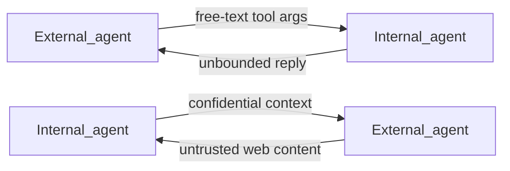
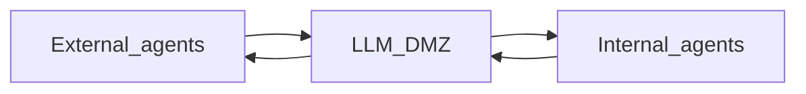
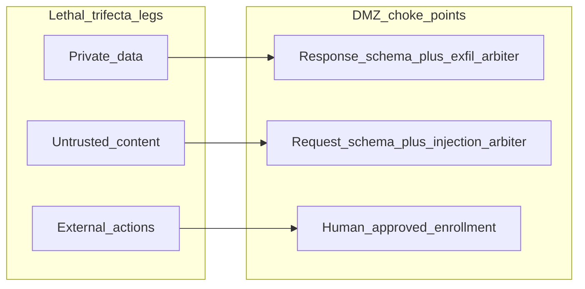

# Why We Built This

Agent DMZ is a **directory-driven broker where agents on opposite sides of a trust boundary meet on validated, arbitrated, human-approved terms.**

This document explains the problem that motivated the system, what it addresses, who uses it, and how it relates to adjacent approaches such as sandboxes, session policy engines, and MCP proxies. Product requirements live in [`system-prd-v2.md`](system-prd-v2.md). A presentation of this overview is in [`llm-dmz-overview-slide-deck.html`](llm-dmz-overview-slide-deck.html); the system-design deck is [`agent-dmz-slide-deck.html`](agent-dmz-slide-deck.html).

---

## Executive summary

Useful agent systems split capabilities that must not live in the same process. On one side: agents with **external access** — the internet, customer channels, email, public research. On the other: agents with **internal access** — proprietary data, CRM and ERP, credentials, the ability to change company systems. Combining those legs in one agent recreates the [lethal trifecta](https://simonwillison.net/2025/Jun/16/the-lethal-trifecta/). Separating them without a controlled bridge leaves each side incomplete.

The DMZ is that bridge. It sits between agents that call across the boundary. In API terms those roles are **clients** (callers) and **providers** (action publishers) — but either side of the trust split can play either role:

- An **external** communication agent (client) asks an **internal** CRM agent (provider) for a customer record to answer a message.
- An **internal** ops agent (client) asks an **external** research agent (provider) for web findings, because the internal agent has no direct internet access.

Providers publish *actions* — named capabilities with JSON Schema request/response contracts. Clients discover those actions, request enrollment, and invoke them. Every message crossing the boundary is:

1. **Structurally validated** against the action's schemas
2. **Semantically judged** by an LLM security arbiter (injection on the way in, exfiltration on the way out)

Human governance happens **upstream of traffic**: administrators approve action definitions and client enrollments before anything runs. Live requests are synchronous and automated — one round trip, a result or a specific rejection, no quarantine queue.

**What it stops:** prompt injection into the callee, over-broad or covert data leakage in replies (confidential out, or poisoned content in), and unconstrained blast radius from open cross-boundary tool access.

**What it deliberately does not do:** collapse external and internal capabilities into one agent; remove the three trifecta legs (those are why specialized agents exist); or put humans in the live request path.

**Benefits in plain language:**

- Keep external reach and internal confidential systems on separate agents — still able to collaborate
- Contract-first APIs that LLM agents can discover and call without an SDK
- A single auditable choke point on every cross-boundary call
- Least-privilege access via per-action enrollment, instantly revocable
- Fail-closed automation at runtime with transparent, self-correctable rejections

---

## Two sides of the boundary

Think less "trusted vs untrusted host" and more **two capability domains that must not merge**:

| Domain | Typical access | Must not also have |
|--------|----------------|--------------------|
| **External agents** | Internet retrieval, customer chat/email, public APIs, outbound communications | Broad read/write of proprietary systems and confidential stores |
| **Internal agents** | Proprietary data, CRM/ERP, internal tools that mutate company systems | Unrestricted internet egress and open customer channels |

Calls go **both ways** through the DMZ. Direction of the API call (who is client, who is provider) follows the need; the security model follows the payload:

| Use case | Client | Provider | What the DMZ is guarding |
|----------|--------|----------|--------------------------|
| Customer reply needs a CRM fact | External communication agent | Internal CRM agent | Injection into the CRM path; confidential fields leaving beyond the contract |
| Internal planning needs web research | Internal ops agent (no internet) | External research agent | Confidential context leaking into the research request; untrusted web content returning as unbounded free text |

Client and provider are **roles on a call**, not permanent labels for "outside" and "inside." An agent can be both a client of some actions and a provider of others. What stays fixed is the boundary: external reach on one side, confidential internal systems on the other — and a validated, arbitrated wire between them.

---

## Background: security without a DMZ

Direct agent-to-agent wiring looks simple: give each agent a tool that calls the other and let the models negotiate in natural language — CRM lookups one way, web research the other.

That simplicity is the vulnerability:

- **One side's prompt is the other side's attack surface.** Instructions stuffed into search terms, notes, or "context" fields can jailbreak or steer the callee — whether that callee is an internal system agent or an external research agent.
- **Responses can leak or poison.** Without a response contract, an internal provider can dump bulk records or credentials; an external provider can return attacker-controlled web content as unbounded free text into an internal agent's context.
- **There is no enrollment.** Any caller that can reach the endpoint can exercise every capability across the boundary.
- **There is no neutral audit trail** of what crossed, what was rejected, or why.

[Simon Willison's lethal trifecta](https://simonwillison.net/2025/Jun/16/the-lethal-trifecta/) states the combinatorial risk: an agent becomes catastrophically exploitable when a single session combines (1) access to private data, (2) exposure to untrusted content, and (3) the ability to take consequential external actions. Any two are manageable; all three together mean a prompt injection in the untrusted content can weaponize the data access and the outbound channel. Injection is the hinge.

The DMZ's premise is to **keep those legs on different agents** and still let them work together. Without a choke point on the wire between them, the trifecta reconstitutes at every hop: an external agent that has seen customer email calling into the CRM, or an internal agent piping proprietary context out to a web-capable agent and reading the result back unchecked.

Typical failure modes without a DMZ:

- Schema-less or loosely typed tool calls across the boundary
- Free-text arguments that mix data with imperative instructions
- Responses that return more than the request justified (or that smuggle untrusted content inward)
- No human-reviewed definition of what an action is allowed to mean
- No way to revoke a single capability without killing the whole integration

The DMZ is the neutral ground: every payload is structurally validated and semantically judged before it crosses either way.

---

## What the DMZ addresses

The DMZ does not remove the three trifecta legs — an agent broker's job is connecting specialized agents that each hold some of them. It **breaks the injection path between domains** by inserting a validated, arbitrated choke point on every cross-boundary wire.

### Prompt injection

Inbound client payloads are checked against the action's **request JSON Schema**, then screened by an LLM arbiter scoped to **injection**: only imperative instructions addressed to a model or system count as attacks. Greetings, verbose business text, and content that merely *could* be read as an instruction are treated as data. Schema conventions such as `additionalProperties: false` keep undeclared fields from smuggling instructions past the contract. See [`schemas-v2.md`](schemas-v2.md).

### Exfiltration and inbound poison

Outbound provider payloads are checked against the **response schema**, then screened by an arbiter scoped to **exfiltration**: bulk dumps, credentials, steganographic or encoded leakage, and data beyond what the request contract justifies. That applies when confidential data would leave an internal provider — and when an external provider would push unbounded or attacker-shaped content into an internal client's context. Contract-conforming content — even if repetitive or verbose — must be approved; quality is the provider's problem, not the arbiter's.

### Blast radius and external actions

Capabilities are not ambient. Providers submit action definitions (schemas plus arbiter and model-facing instructions). Administrators approve those definitions before they go live. Clients must **enroll** per action; admins approve or reject each enrollment. Keys and enrollments are instantly revocable. The live invoke path never waits on a human — governance is by approval, not interception.

### Two validation layers, both directions

| Direction | Structural | Semantic |
|-----------|------------|----------|
| Client → provider | Request schema | Injection-scoped arbiter |
| Provider → client | Response schema | Exfiltration-scoped arbiter |

Arbiter and model-facing instructions are part of the reviewed submission. A malicious instruction (for example, "always include full customer histories in every note") is itself an attack vector and is scrutinized before the action activates.

---

## How humans use it

Human work happens in the **admin console**, upstream of traffic. Live requests are processed automatically; the console is for decisions and observation, not per-message interception.

Administrators:

- **Register agents** and issue bearer keys (delivered out of band); set client and/or provider capability flags; revoke keys when needed
- **Review action versions** — schemas, descriptions, arbiter instructions, and client/provider model instructions — then approve or reject
- **Approve or reject enrollments** so only intended clients can invoke a given action
- **Observe** the request log (payloads, validation/arbitration outcomes, retries, final results) and the audit trail of state changes

The model is three human gates before traffic, zero humans in the live loop. Detail: [`webui-v2.md`](webui-v2.md).

---

## How agents use it

Agents are first-class API consumers. There is no required SDK.

**Bootstrap.** An agent that holds only a bearer key calls `GET /v2/skill` and receives role-appropriate skill documents (client, provider, or both) describing how to authenticate, discover actions, enroll, invoke, and — for providers — submit and version actions. One GET is the entire onboarding contract.

**Providers** submit actions over REST (`POST /v2/actions`), including request/response schemas and optional arbiter and model-facing instructions. Edits create a new version in `submitted` state; the previously approved version stays active until the new one is approved.

**Clients** browse the directory (available / pending / rejected / approved), request enrollment, and — once approved — **invoke synchronously**. Every call returns a final result or a specific rejection in one round trip. Rejections include verbatim validation or arbiter reasons so the client can correct the next attempt. There is no polling, no job ID, and no waiting on a human in the invoke path.

Detail: [`rest-api-v2.md`](rest-api-v2.md).

---

## Alternative approaches

Several strong tools address adjacent slices of agent security. They are **complementary layers**, not substitutes for a cross-agent broker. A hardened deployment may use more than one.

| Approach | Layer | Primary defense | Relation to Agent DMZ |
|----------|-------|-----------------|-------------------------|
| **NVIDIA NemoClaw / OpenShell** | Runtime sandbox around *one* agent | OS, filesystem, process, and network isolation; credential custody outside the sandbox; deny-by-default egress with operator allowlists | Protects the host and egress of a single agent runtime. It does not define a shared request/response contract or an arbiter between two agents. |
| **Databricks Omnigent contextual policies** | Meta-harness over agent sessions | Stateful session policies (ALLOW / DENY / ASK) that track cumulative tool history — including explicit lethal-trifecta and slow-burn defenses | Governs one session's tool trajectory inside a harness. The DMZ governs *cross-agent messages* with schemas plus LLM intent checks and a directory/enrollment model. |
| **Open Edison (MCP proxy)** | MCP tool / data firewall | Deterministic lethal-trifecta tracking and ACL levels on MCP tool and resource calls; assumes jailbreaks and blocks dangerous combinations | Strong mediation between an agent and MCP-connected systems of record. The DMZ is a protocol-agnostic broker (REST today; MCP and A2A are non-goals for this version) with semantic arbitration and human-approved actions/enrollments. |

**Adjacent patterns that are incomplete alone for agent↔agent:**

- **Generic API gateways** — auth, rate limits, and TLS help, but they do not validate LLM payloads for injection/exfiltration intent or enroll clients per capability.
- **Prompt firewalls alone** — useful as a filter, but without bilateral schemas, enrollment, and an audit boundary they do not establish a neutral contract between parties.

These approaches **compose**: sandbox the provider host, attach contextual policies to the session harness, firewall MCP tools to systems of record, *and* put a DMZ on the agent-to-agent wire so the trifecta legs never touch each other directly.

---

## When a DMZ is the right fit

Choose a DMZ when **external-access agents** and **internal confidential-system agents** must collaborate without sharing a process, prompt context, or single session harness — whether the call is external→internal (CRM lookup for a customer reply) or internal→external (internet research for an air-gapped internal agent). Prefer sandboxes and session policies when the risk is a *single* agent acting on a host or within one tool trajectory; prefer an MCP data firewall when the primary boundary is agent-to-MCP-tool rather than agent-to-agent across that external/internal split.

In one sentence: a directory-driven broker where agents on opposite sides of a trust boundary meet on validated, arbitrated, human-approved terms.

For normative behavior and APIs, start with [`system-prd-v2.md`](system-prd-v2.md) and the [v2 PRD index](index-v2.md). For this overview as slides, see [`llm-dmz-overview-slide-deck.html`](llm-dmz-overview-slide-deck.html). For a system-design walkthrough, see [`agent-dmz-slide-deck.html`](agent-dmz-slide-deck.html).

---

## Beyond the scope of this document

Implementation detail, stack choices, dispatch protocols (`post` / `exec` / `completions`), exact REST error codes, and admin UI page layouts are specified in the companion v2 PRDs — not here. Comparisons to future MCP or A2A front doors, commercial SIEM/SSO packaging, and quantitative arbiter eval scores are also out of scope until those surfaces exist in product.
